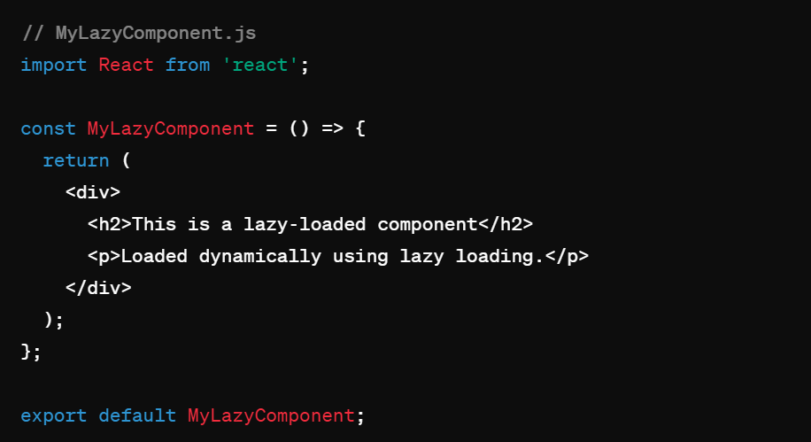
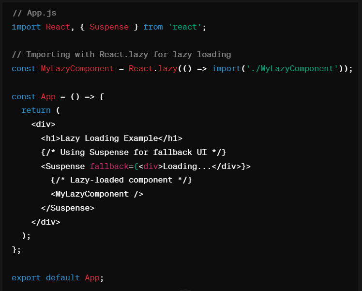

## Lazy Loading

> What is Lazy Loading ?

Lazy loading in ReactJS refers to a technique used to optimize the performance of web applications by dynamically loading components only when they are needed. Instead of loading all components and their dependencies when the application initially loads, lazy loading defers the loading of certain components until the user interacts with them or navigates to a specific route that requires those components.

Lazy loading is particularly beneficial for applications with large codebases or complex user interfaces, as it helps reduce the initial bundle size and improves the application's loading time. This is achieved by splitting the application into smaller chunks or bundles, and loading them asynchronously when needed.

React provides a built-in mechanism for lazy loading using the React.lazy() function and the Suspense component.

> Code Example 

> Explanation 

MyLazyComponent.js contains the code for the component that will be lazily loaded. It's a simple functional component.

In App.js, the lazy loading is done using **React.lazy()**, which asynchronously imports the component when needed.

The **Suspense** component is used to specify a fallback UI (in this case, a simple "Loading..." message) while the lazy-loaded component is being fetched.

Within Suspense, the lazily loaded component <MyLazyComponent /> is rendered. When React reaches this point and sees that MyLazyComponent is not yet loaded, it will display the fallback UI specified by Suspense. Once MyLazyComponent is loaded, it replaces the fallback UI and renders normally.